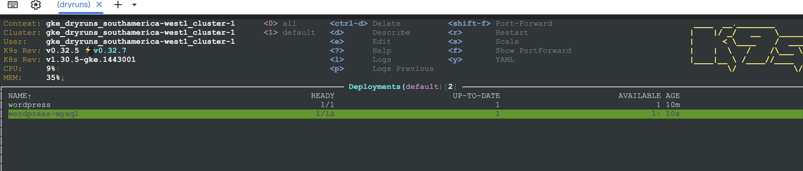

# gke-backup


1. Consider you have an initial cluster already deployed. 
2. Generate a secret for the deployment: 

```shell
kubectl create secret generic mysql-pass --from-literal=password=welcome1     
secret/mysql-pass created
```

3. Deploy a workload that serves as proof of backup process. In this case: 

```shell
kubectl apply -f https://k8s.io/examples/application/wordpress/mysql-deployment.yaml
kubectl apply -f https://k8s.io/examples/application/wordpress/wordpress-deployment.yaml
```

4. Get services from kubernetes and get the external load balancer ip, to configure wordpress. Enter username `root` and a password of your choice. This is just to proof the backup point. 


5. Create backup using the console


6. Once created, delete all the deployments related to wordpress example.


7. To recover cluster, create a restore plan based on the backup already taken. 


8. Restore the cluster from backup


9. Upon restoration, the recovery will look like this: 

